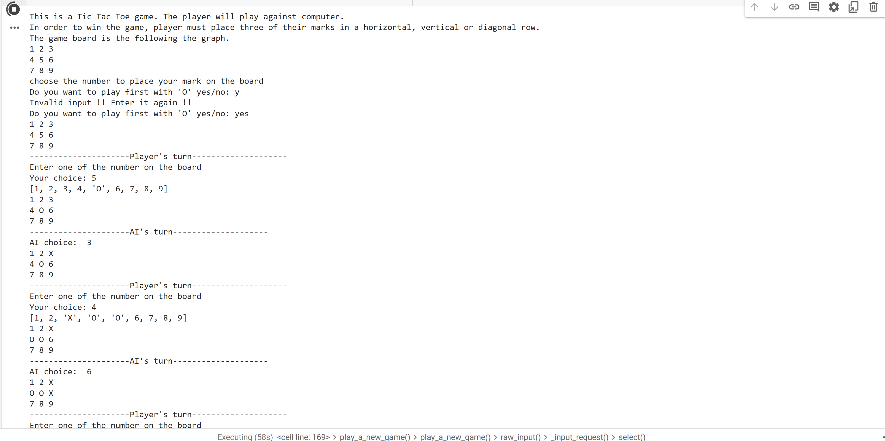
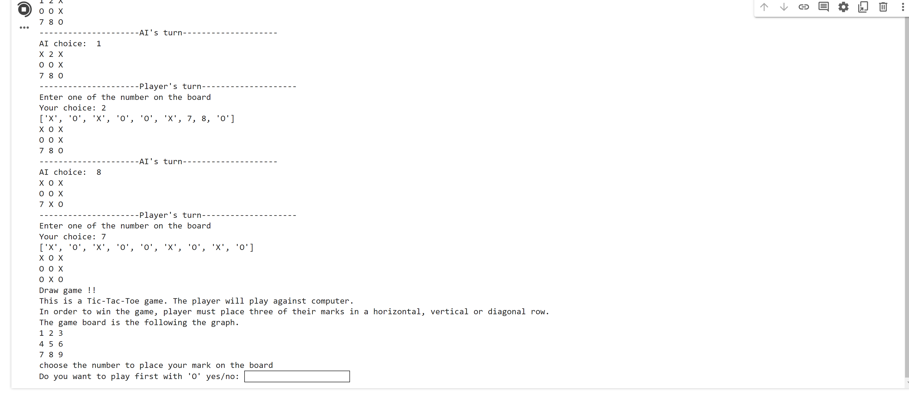

# Tic-tac-toe

AI that plays tic-tac-toe.

Algorithm: MCT search.

You can choose to play first or second hand againest the AI.

Requirements: IDEs that can run python code

The gameboard looks as follows.

1 2 3

4 5 6

7 8 9

If you choose to play first and choose 1, the gameboard will be

O 2 3

4 5 6

7 8 9

Hope you have a good time with my toy AI "_"

### Demo

